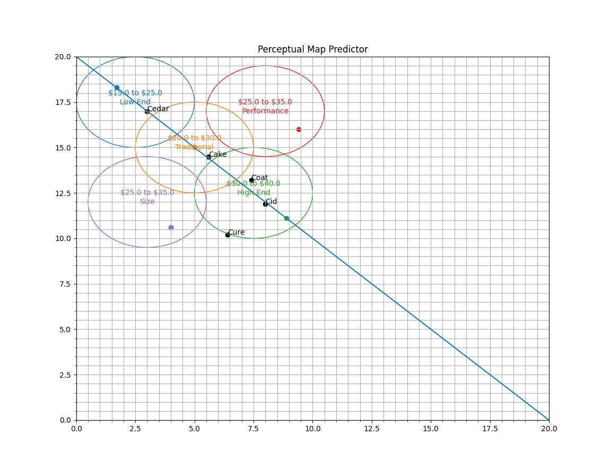

# Market Predictor
This will allow you to predict a market's positioning at various moments in time.

## Usage
Move the slider at the bottom to change the market's positioning. You can also update locations of products as well.

## Dependencies
This list may grow longer as more features are added. Here is a list of things to `pip install`.

 * `matplotlib`
 * `numpy`
 * `tkinter` (I think this comes pre-installed already)
 * `pypubsub`

Command: `pip install matplotlib numpy pypubsub`

## Installation
### Windows
 * Install python:
     * Go [here](https://www.python.org/downloads/) and click "Download Python".
     * Run the python installer. Make sure to check the "Add (something) to path" box; then click "Install Now".
     * Check everything worked:
       * Type `cmd` in the bottom-left program search box thing and click "command prompt". A window that lets you enter commands should pop up.
       * Type `python` into the command prompt and hit enter. If you get an error saying python isn't installed,
         run the installer again and check the "Add (something) to path" box.
       * If you get `>>>` next to your cursor instead, that means python is installed! Type `quit()` and hit enter to get out. 
 * Install dependencies
     * Open up a command prompt again and type `pip install matplotlib numpy pypubsub`. 
     * Why is this necessary? When I wrote my code, I actually used libraries written by other people to speed development.
       `matplotlib` does all of the plotting, and `numpy` does the math. 
 * Download [this thing](https://raw.githubusercontent.com/rajansaini691/marketpredictor/main/main.py) to a desired place on your computer.
 * If everything worked (which may not be the case), double-clicking on that file should automatically run the program!

### Mac
 * I don't have a mac, so I don't know the precise steps, but here's a birds-eye view:
    * Figure out how to open a terminal
    * Learn how to use `cd` and `ls` to open folders and see what's in them (this will be crucial later on)
      * Helpful tip: `cd ..` lets you go up
    * Try typing this command into the terminal: `git clone https://github.com/rajansaini691/marketpredictor.git`
      * If you get some sort of "command not found" error, you'll have to figure out how to [install git on a mac](https://git-scm.com/book/en/v2/Getting-Started-Installing-Git).
      * If the git clone command didn't already work, try it again. It basically downloads all of the code to a folder on your computer automatically.
    * Type `cd marketpredictor`
    * Type `pip install matplotlib numpy pypubsub`. If this doesn't work, figure out how to install python on a mac
    * `python main.py` should run the program!
### Linux
Just clone the repository and run `python main.py`
